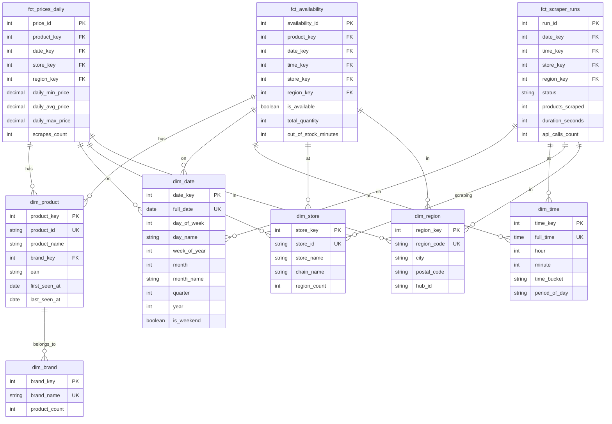

# Logical Data Model Template

## What is a Logical Data Model?

A **Logical Data Model** defines how data entities relate to each other, independent of physical implementation. It includes:

- **Entities** (tables/views)
- **Attributes** (columns)
- **Primary & Foreign Keys**
- **Relationships** (1:many, many:many)
- **Data Grain** (what each row represents)
- **Business rules** (constraints, validations)

**Note**: Logical model focuses on **structure**, not implementation (data types, indexes, partitions = physical model).

---

## Market Scraper Logical Data Model

### Entity-Relationship Diagram (ERD)



**Legend**:
- `PK`: Primary Key
- `FK`: Foreign Key
- `UK`: Unique Key (natural key)
- `||--o{`: One-to-Many relationship

---

## Entities (Tables) - Detailed Specification

### 🟧 Fact Tables

#### `fct_prices_daily`

**Description**: Daily aggregated price metrics per product per store per region.

**Grain**: One row per product per store per region per day.

| Column              | Type    | Description                                   | Constraints           |
| ------------------- | ------- | --------------------------------------------- | --------------------- |
| `price_id`          | INTEGER | Surrogate key (auto-increment)                | PK, NOT NULL          |
| `product_key`       | INTEGER | Foreign key to `dim_product`                  | FK, NOT NULL          |
| `date_key`          | INTEGER | Foreign key to `dim_date`                     | FK, NOT NULL          |
| `store_key`         | INTEGER | Foreign key to `dim_store`                    | FK, NOT NULL          |
| `region_key`        | INTEGER | Foreign key to `dim_region`                   | FK, NOT NULL          |
| `daily_min_price`   | DECIMAL | Minimum price observed during the day         | NOT NULL, CHECK >= 0  |
| `daily_avg_price`   | DECIMAL | Average price                                 | NOT NULL, CHECK >= 0  |
| `daily_max_price`   | DECIMAL | Maximum price                                 | NOT NULL, CHECK >= 0  |
| `scrapes_count`     | INTEGER | Number of scrapes for this product/day        | NOT NULL, CHECK >= 1  |
| `loaded_at`         | TIMESTAMP | ETL timestamp                               | NOT NULL              |

**Business Rules**:
- `daily_min_price <= daily_avg_price <= daily_max_price`
- Unique composite key: `(product_key, date_key, store_key, region_key)`

---

#### `fct_availability`

**Description**: Hourly product availability status.

**Grain**: One row per product per store per region per hour.

| Column                    | Type      | Description                              | Constraints      |
| ------------------------- | --------- | ---------------------------------------- | ---------------- |
| `availability_id`         | INTEGER   | Surrogate key                            | PK, NOT NULL     |
| `product_key`             | INTEGER   | Foreign key to `dim_product`             | FK, NOT NULL     |
| `date_key`                | INTEGER   | Foreign key to `dim_date`                | FK, NOT NULL     |
| `time_key`                | INTEGER   | Foreign key to `dim_time`                | FK, NOT NULL     |
| `store_key`               | INTEGER   | Foreign key to `dim_store`               | FK, NOT NULL     |
| `region_key`              | INTEGER   | Foreign key to `dim_region`              | FK, NOT NULL     |
| `is_available`            | BOOLEAN   | In stock?                                | NOT NULL         |
| `total_quantity`          | INTEGER   | Available quantity                       | CHECK >= 0       |
| `out_of_stock_minutes`    | INTEGER   | Minutes out of stock during hour         | CHECK 0-60       |
| `loaded_at`               | TIMESTAMP | ETL timestamp                            | NOT NULL         |

**Business Rules**:
- If `is_available = false` then `total_quantity = 0`
- Unique composite key: `(product_key, date_key, time_key, store_key, region_key)`

---

#### `fct_scraper_runs`

**Description**: Operational metrics for each scraper execution (observability).

**Grain**: One row per scraper run per store per region.

| Column               | Type      | Description                          | Constraints                          |
| -------------------- | --------- | ------------------------------------ | ------------------------------------ |
| `run_id`             | VARCHAR   | Scraper execution ID                 | PK, NOT NULL, UK                     |
| `date_key`           | INTEGER   | Foreign key to `dim_date`            | FK, NOT NULL                         |
| `time_key`           | INTEGER   | Foreign key to `dim_time`            | FK, NOT NULL                         |
| `store_key`          | INTEGER   | Foreign key to `dim_store`           | FK, NOT NULL                         |
| `region_key`         | INTEGER   | Foreign key to `dim_region`          | FK, NULLABLE (NULL = all regions)    |
| `status`             | VARCHAR   | Execution status                     | CHECK IN ('success', 'failed', 'partial') |
| `products_scraped`   | INTEGER   | Number of products collected         | CHECK >= 0                           |
| `duration_seconds`   | INTEGER   | Execution duration                   | CHECK >= 0                           |
| `api_calls_count`    | INTEGER   | API requests made                    | CHECK >= 0                           |
| `api_errors_count`   | INTEGER   | API errors encountered               | CHECK >= 0                           |
| `loaded_at`          | TIMESTAMP | ETL timestamp                        | NOT NULL                             |

**Business Rules**:
- `api_errors_count <= api_calls_count`
- If `status = 'failed'` then `products_scraped = 0`

---

### 🟦 Dimension Tables (Conformed)

#### `dim_date`

**Description**: Calendar dimension (date attributes).

**Grain**: One row per day (populated for next 10 years).

| Column           | Type    | Description                  | Constraints       |
| ---------------- | ------- | ---------------------------- | ----------------- |
| `date_key`       | INTEGER | Surrogate key (YYYYMMDD)     | PK, NOT NULL      |
| `full_date`      | DATE    | Actual date                  | UK, NOT NULL      |
| `day_of_week`    | INTEGER | 1-7 (Monday=1)               | CHECK 1-7         |
| `day_name`       | VARCHAR | Monday, Tuesday, etc.        | NOT NULL          |
| `week_of_year`   | INTEGER | 1-53                         | CHECK 1-53        |
| `month`          | INTEGER | 1-12                         | CHECK 1-12        |
| `month_name`     | VARCHAR | January, February, etc.      | NOT NULL          |
| `quarter`        | INTEGER | 1-4                          | CHECK 1-4         |
| `year`           | INTEGER | Calendar year                | CHECK >= 2020     |
| `is_weekend`     | BOOLEAN | Saturday or Sunday?          | NOT NULL          |
| `is_holiday`     | BOOLEAN | Brazilian holiday?           | NOT NULL          |

**Business Rules**:
- Pre-populated for 2020-01-01 to 2035-12-31
- `date_key` format: `YYYYMMDD` (e.g., 20260205 for 2026-02-05)

---

#### `dim_time`

**Description**: Time-of-day dimension (hour/minute attributes).

**Grain**: One row per minute (1440 rows total).

| Column           | Type    | Description                    | Constraints    |
| ---------------- | ------- | ------------------------------ | -------------- |
| `time_key`       | INTEGER | Surrogate key (HHMM)           | PK, NOT NULL   |
| `full_time`      | TIME    | Actual time                    | UK, NOT NULL   |
| `hour`           | INTEGER | 0-23                           | CHECK 0-23     |
| `minute`         | INTEGER | 0-59                           | CHECK 0-59     |
| `time_bucket`    | VARCHAR | 15-min bucket (06:00-06:15)    | NOT NULL       |
| `period_of_day`  | VARCHAR | Morning, Afternoon, Evening    | NOT NULL       |

**Business Rules**:
- Pre-populated for all 1440 minutes (00:00 to 23:59)
- `time_key` format: `HHMM` (e.g., 615 for 06:15)

---

#### `dim_product`

**Description**: Product master (conformed dimension).

**Grain**: One row per unique product (across all stores).

| Column            | Type      | Description                    | Constraints      |
| ----------------- | --------- | ------------------------------ | ---------------- |
| `product_key`     | INTEGER   | Surrogate key                  | PK, NOT NULL     |
| `product_id`      | VARCHAR   | Natural key (VTEX product ID)  | UK, NOT NULL     |
| `product_name`    | VARCHAR   | Product name                   | NOT NULL         |
| `brand_key`       | INTEGER   | Foreign key to `dim_brand`     | FK, NULLABLE     |
| `ean`             | VARCHAR   | Barcode (EAN-13)               | NULLABLE         |
| `first_seen_at`   | DATE      | First scrape date              | NOT NULL         |
| `last_seen_at`    | DATE      | Latest scrape date             | NOT NULL         |
| `loaded_at`       | TIMESTAMP | ETL timestamp                  | NOT NULL         |

**Business Rules**:
- `last_seen_at >= first_seen_at`
- If product discontinued: `last_seen_at < CURRENT_DATE - 30 days`

---

#### `dim_brand`

**Description**: Brand master.

**Grain**: One row per brand.

| Column           | Type      | Description                    | Constraints      |
| ---------------- | --------- | ------------------------------ | ---------------- |
| `brand_key`      | INTEGER   | Surrogate key                  | PK, NOT NULL     |
| `brand_name`     | VARCHAR   | Brand name                     | UK, NOT NULL     |
| `product_count`  | INTEGER   | Number of products with brand  | CHECK >= 0       |
| `loaded_at`      | TIMESTAMP | ETL timestamp                  | NOT NULL         |

---

#### `dim_store`

**Description**: Store master.

**Grain**: One row per store chain.

| Column           | Type      | Description                    | Constraints      |
| ---------------- | --------- | ------------------------------ | ---------------- |
| `store_key`      | INTEGER   | Surrogate key                  | PK, NOT NULL     |
| `store_id`       | VARCHAR   | Natural key (bistek, fort)     | UK, NOT NULL     |
| `store_name`     | VARCHAR   | Display name                   | NOT NULL         |
| `chain_name`     | VARCHAR   | Parent chain                   | NULLABLE         |
| `region_count`   | INTEGER   | Number of regions scraped      | CHECK >= 1       |
| `loaded_at`      | TIMESTAMP | ETL timestamp                  | NOT NULL         |

**Business Rules**:
- Accepted values: `bistek`, `fort`, `giassi` (validated in DBT test)

---

#### `dim_region`

**Description**: Geographic region master.

**Grain**: One row per scraped region (city + area).

| Column           | Type      | Description                    | Constraints      |
| ---------------- | --------- | ------------------------------ | ---------------- |
| `region_key`     | INTEGER   | Surrogate key                  | PK, NOT NULL     |
| `region_code`    | VARCHAR   | Natural key (florianopolis_costeira) | UK, NOT NULL |
| `city`           | VARCHAR   | City name                      | NOT NULL         |
| `postal_code`    | VARCHAR   | CEP (Brazilian ZIP)            | NULLABLE         |
| `hub_id`         | VARCHAR   | VTEX hub identifier            | NULLABLE         |
| `loaded_at`      | TIMESTAMP | ETL timestamp                  | NOT NULL         |

---

## Relationships

### Star Schema Design

```
                dim_date ────┐
                             │
                dim_time ────┼──── fct_prices_daily
                             │
                dim_product ─┤
                             │
                dim_store ───┼──── fct_availability
                             │
                dim_region ──┘

                             └──── fct_scraper_runs
```

**Relationship Types**:
- **One-to-Many**: One dimension → Many fact rows
  - Example: One `dim_product` row can appear in many `fct_prices_daily` rows
- **Mandatory**: All FKs are NOT NULL (except where business allows)
- **Referential Integrity**: All FKs must exist in parent dimension

---

## Validation Rules

### Data Quality Tests (DBT)

```yaml
# models/marts/fct_prices_daily.yml
models:
  - name: fct_prices_daily
    tests:
      # Primary key uniqueness
      - dbt_utils.unique_combination_of_columns:
          combination_of_columns:
            - product_key
            - date_key
            - store_key
            - region_key

      # Foreign key relationships
      - relationships:
          to: ref('dim_product')
          field: product_key
      - relationships:
          to: ref('dim_date')
          field: date_key
      - relationships:
          to: ref('dim_store')
          field: store_key
      - relationships:
          to: ref('dim_region')
          field: region_key

      # Business rules
      - dbt_utils.expression_is_true:
          expression: "daily_min_price <= daily_avg_price"
      - dbt_utils.expression_is_true:
          expression: "daily_avg_price <= daily_max_price"
```

---

## Naming Conventions

### Tables:
- **Facts**: `fct_<process>` (e.g., `fct_prices_daily`)
- **Dimensions**: `dim_<entity>` (e.g., `dim_product`)
- **Bridges**: `brg_<relationship>` (if many-to-many)

### Columns:
- **Surrogate Keys**: `<entity>_key` (e.g., `product_key`)
- **Natural Keys**: `<entity>_id` or `<entity>_code` (e.g., `product_id`)
- **Foreign Keys**: Same as dimension PK (e.g., `product_key`)
- **Measures**: Descriptive names (e.g., `daily_min_price`, not `price1`)
- **Booleans**: `is_<attribute>` or `has_<attribute>` (e.g., `is_available`)

---

## Physical Implementation Notes

**Not part of logical model, but useful for physical design:**

- **Partitioning**: Fact tables by `date_key` (monthly partitions)
- **Indexing**: Dimension PKs, Fact FKs
- **Compression**: Parquet with Snappy (bronze layer)
- **Incremental**: Facts use DBT incremental materialization
- **Snapshots**: SCD Type 2 for `dim_product` (track brand changes)

---

## Next Steps

1. **Review with stakeholders** - Validate grain, attributes, relationships
2. **Prototype in DBT** - Create dimension stubs with sample data
3. **Build lineage** - Document source → staging → trusted → marts flow
4. **Add tests** - Implement validation rules in `schema.yml`
5. **Generate docs** - Run `dbt docs generate` for ER diagram visualization

---

## References

- [Kimball Dimensional Modeling](https://www.kimballgroup.com/data-warehouse-business-intelligence-resources/kimball-techniques/dimensional-modeling-techniques/)
- [DBT Model Contracts](https://docs.getdbt.com/reference/resource-configs/contract)
- [Star Schema Design](https://en.wikipedia.org/wiki/Star_schema)
- [Mermaid ER Diagrams](https://mermaid.js.org/syntax/entityRelationshipDiagram.html)
